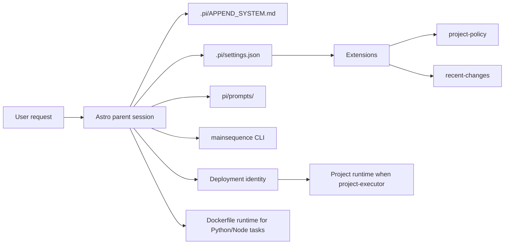

# Astro docs

Astro is a Pi package that acts as a parent orchestrator for Main Sequence project assistants.

This documentation set is organized for readers who may not know Pi yet. It explains Astro from the outside in:

1. what Pi components Astro uses
2. how those components are wired together
3. how the prompt and runtime-agent layers drive project behavior
4. where the per-file extension and prompt docs live

## Run the local executor runtime

If you want to inspect the dedicated project runtime instead of the full Astro orchestrator, use
the local executor container harness:

```bash
export A2A_DEV_PROJECT=/absolute/path/to/checked-out-project
export ASTRO_EXECUTOR_PROJECT_ID=<project-id>
docker compose up astro-project-executor
```

## Architecture



## Read first

- New to Pi:
  - [`getting-started/pi-primer.md`](./getting-started/pi-primer.md)
  - [`getting-started/request-lifecycle.md`](./getting-started/request-lifecycle.md)
- Just want to run Astro:
  - [`getting-started/quickstart.md`](./getting-started/quickstart.md)
- Want the reusable workflow definitions:
  - [`components/prompts.md`](./components/prompts.md)
- Want the mirrored per-file runtime docs:
  - [`extensions/README.md`](./extensions/README.md)
  - [`prompts/README.md`](./prompts/README.md)

## Pi components in Astro

- [`components/settings-and-system-prompt.md`](./components/settings-and-system-prompt.md)
  - `.pi/settings.json`, `.pi/APPEND_SYSTEM.md`, and child policy
- [`components/extensions.md`](./components/extensions.md)
  - custom hooks and tools in `pi/extensions/hooks/` and `pi/extensions/tools/`
- [`extensions/README.md`](./extensions/README.md)
  - per-file docs for hooks, tools, and shared helpers in `pi/extensions/`
- [`components/agents.md`](./components/agents.md)
  - optional project-local specialist prompts and why the core executor prompt is unified
- [`components/prompts.md`](./components/prompts.md)
  - reusable workflow prompts in `pi/prompts/`
- [`prompts/README.md`](./prompts/README.md)
  - per-file docs for workflow prompts in `pi/prompts/`
- [`components/skills.md`](./components/skills.md)
  - repo-local skills in `pi/skills/`
- [`components/knowledge.md`](./components/knowledge.md)
  - why `knowledge/` was removed and what replaces it
- [`components/scripts-and-runtime.md`](./components/scripts-and-runtime.md)
  - scripts, TypeScript runtime, and Docker-backed Python path
- [`components/deployment-identities.md`](./components/deployment-identities.md)
  - `astro-orchestrator`, `project-executor`, fixed runtime env, and sidecar path contract
- [`components/remote-worker-image.md`](./components/remote-worker-image.md)
  - `Dockerfile.remote-worker`, image-backed executor pods, and required runtime env

## Interface

- [`interface/README.md`](./interface/README.md)

## Reference

- [`reference/adr-custom-model-integration.md`](./reference/adr-custom-model-integration.md)
- [`reference/adr-backend-owned-agent-session-allocation.md`](./reference/adr-backend-owned-agent-session-allocation.md)
- [`reference/adr-backend-owned-provider-credentials.md`](./reference/adr-backend-owned-provider-credentials.md)
- [`reference/adr-compaction-checkpoint-retention.md`](./reference/adr-compaction-checkpoint-retention.md)
- [`reference/adr-emptydir-session-checkpoint-storage.md`](./reference/adr-emptydir-session-checkpoint-storage.md)
- [`reference/adr-editable-session-config.md`](./reference/adr-editable-session-config.md)
- [`reference/adr-interactive-provider-signin.md`](./reference/adr-interactive-provider-signin.md)
- [`reference/adr-remote-model-providers.md`](./reference/adr-remote-model-providers.md)
- [`reference/adr-runtime-credential-auth.md`](./reference/adr-runtime-credential-auth.md)
- [`reference/adr-session-usage-and-context.md`](./reference/adr-session-usage-and-context.md)
- [`reference/folder-structure.md`](./reference/folder-structure.md)
- [`reference/decisions.md`](./reference/decisions.md)
- [`reference/persistent-state.md`](./reference/persistent-state.md)
- [`reference/scope.md`](./reference/scope.md)
- [`reserach_guide/research_guide.md`](./reserach_guide/research_guide.md)

## Generated context

Astro no longer uses a generated `knowledge/` cache. All canonical documentation lives under `docs/`.
