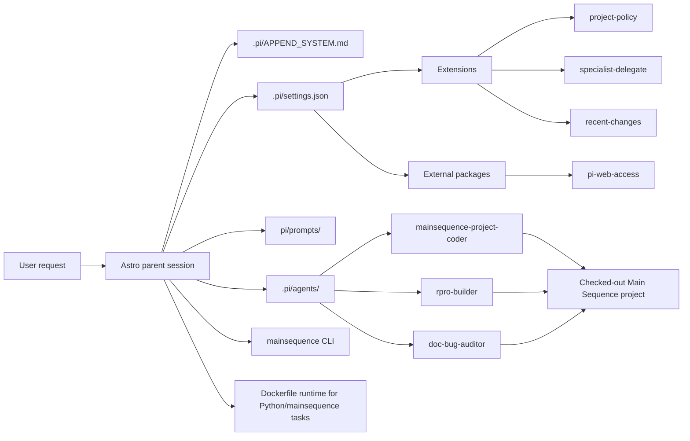

# Astro docs

Astro is a Pi package that acts as a parent orchestrator for Main Sequence project assistants.

This documentation set is organized for readers who may not know Pi yet. It explains Astro from the outside in:

1. what Pi components Astro uses
2. how those components are wired together
3. which workflows Astro runs

## Launch one specialist directly

If you want Pi to start in single-specialist mode instead of the full Astro orchestrator, use:

```bash
npm run specialist -- --agent mainsequence-project-coder --cwd /absolute/path/to/checked-out-project
```

That launches Pi with:

- `ASTRO_SUBAGENT_CHILD=1`
- `ASTRO_ACTIVE_SPECIALIST=mainsequence-project-coder`
- the `mainsequence-project-coder` prompt body as the appended system prompt
- the specialist's tool restrictions

If you want to launch it non-interactively with one task:

```bash
npm run specialist -- --agent mainsequence-project-coder --cwd /absolute/path/to/checked-out-project "Read astro/tasks.md and implement the next task"
```

## Architecture



## Read first

- New to Pi:
  - [`getting-started/pi-primer.md`](./getting-started/pi-primer.md)
  - [`getting-started/request-lifecycle.md`](./getting-started/request-lifecycle.md)
- Just want to run Astro:
  - [`getting-started/quickstart.md`](./getting-started/quickstart.md)
- Want the Main Sequence workflow:
  - [`workflows/main-sequence-project-flow.md`](./workflows/main-sequence-project-flow.md)
- Want the tutorial regression workflow:
  - [`workflows/tutorial-verification.md`](./workflows/tutorial-verification.md)

## Pi components in Astro

- [`components/settings-and-system-prompt.md`](./components/settings-and-system-prompt.md)
  - `.pi/settings.json`, `.pi/APPEND_SYSTEM.md`, and child policy
- [`components/extensions.md`](./components/extensions.md)
  - custom hooks and tools in `pi/extensions/`
- [`components/agents.md`](./components/agents.md)
  - specialist files in `.pi/agents/`
- [`components/prompts.md`](./components/prompts.md)
  - reusable workflow prompts in `pi/prompts/`
- [`components/skills.md`](./components/skills.md)
  - repo-local skills in `pi/skills/`
- [`components/knowledge.md`](./components/knowledge.md)
  - why `knowledge/` was removed and what replaces it
- [`components/scripts-and-runtime.md`](./components/scripts-and-runtime.md)
  - scripts, TypeScript runtime, and Docker-backed Python path

## Workflows

- [`workflows/main-sequence-project-flow.md`](./workflows/main-sequence-project-flow.md)
- [`workflows/tutorial-verification.md`](./workflows/tutorial-verification.md)

## Reference

- [`reference/folder-structure.md`](./reference/folder-structure.md)
- [`reference/decisions.md`](./reference/decisions.md)
- [`reference/scope.md`](./reference/scope.md)
- [`reserach_guide/research_guide.md`](./reserach_guide/research_guide.md)

## Generated context

Astro no longer uses a generated `knowledge/` cache. All canonical documentation lives under `docs/`.
