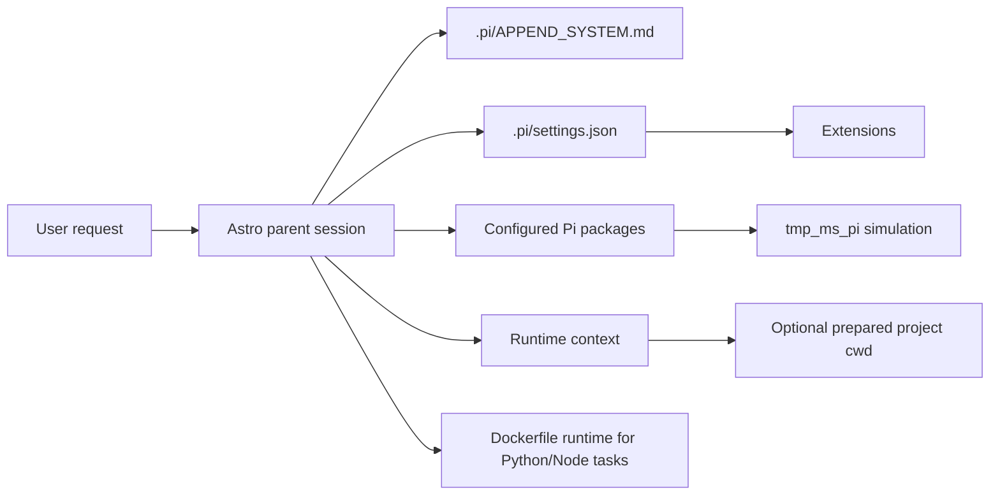

# Astro docs

Astro is a Pi deployment runtime for Main Sequence assistant sessions.

This documentation set is organized for readers who may not know Pi yet. It explains Astro from the outside in:

1. what Pi components Astro uses
2. how those components are wired together
3. how the prompt and runtime-agent layers drive project behavior
4. where package-provided resources enter the runtime

## Run the local project-attached runtime

If you want to inspect Astro running against a prepared project cwd, use the local
project-attached container harness:

```bash
export A2A_DEV_PROJECT=/absolute/path/to/checked-out-project
export ASTRO_EXECUTOR_PROJECT_ID=<project-id>
docker compose up astro-project-executor
```

## Architecture



## Read first

- New to Pi:
  - [`getting-started/pi-primer.md`](./getting-started/pi-primer.md)
  - [`getting-started/request-lifecycle.md`](./getting-started/request-lifecycle.md)
- Just want to run Astro:
  - [`getting-started/quickstart.md`](./getting-started/quickstart.md)
- Want the reusable workflow package boundary:
  - [`components/prompts.md`](./components/prompts.md)
- Want the current public A2A contract:
  - [`a2a/README.md`](./a2a/README.md)
- Want the repo-owned runtime docs:
  - [`extensions/README.md`](./extensions/README.md)

## Pi components in Astro

- [`components/settings-and-system-prompt.md`](./components/settings-and-system-prompt.md)
  - `.pi/settings.json`, `.pi/APPEND_SYSTEM.md`, and configured package prompt composition
- [`components/extensions.md`](./components/extensions.md)
  - Astro Core hooks and tools in `pi/extensions/hooks/` and `pi/extensions/tools/`
- [`extensions/README.md`](./extensions/README.md)
  - per-file docs for hooks, tools, and shared helpers in `pi/extensions/`
- [`components/agents.md`](./components/agents.md)
  - optional project-local specialist prompts and why the core executor prompt is unified
- [`components/prompts.md`](./components/prompts.md)
  - reusable workflow prompts delivered by configured Pi packages
- [`components/skills.md`](./components/skills.md)
  - skills delivered by configured Pi packages
- [`components/runtime-entrypoints-and-tools.md`](./components/runtime-entrypoints-and-tools.md)
  - entrypoints, runtime services, tools, and Docker-backed Python path
- [`components/deployment-identities.md`](./components/deployment-identities.md)
  - backend identity, project attachment, fixed runtime env, and sidecar path contract
- [`components/remote-worker-image.md`](./components/remote-worker-image.md)
  - `Dockerfile.remote-worker`, image-backed project-attached pods, and required runtime env

## Interface

- [`interface/README.md`](./interface/README.md)
- [`a2a/README.md`](./a2a/README.md)

## Reference

- [`reference/decisions.md`](./reference/decisions.md)
- [`reference/adr-25-production-a2a-discovery-and-runtime-access.md`](./reference/adr-25-production-a2a-discovery-and-runtime-access.md)
- [`reference/adr-27-backend-only-session-initiation.md`](./reference/adr-27-backend-only-session-initiation.md)
- [`reference/adr-28-durable-a2a-session-envelope.md`](./reference/adr-28-durable-a2a-session-envelope.md)
- [`reference/adr-29-agent-type-identity.md`](./reference/adr-29-agent-type-identity.md)
- [`reference/adr-30-runtime-profiles-vs-agent-type.md`](./reference/adr-30-runtime-profiles-vs-agent-type.md)
- [`reference/adr-31-backend-uid-identity.md`](./reference/adr-31-backend-uid-identity.md)
- [`reference/adr-32-agent-session-capability-bindings.md`](./reference/adr-32-agent-session-capability-bindings.md)
- [`reference/adr-checkpoint-reasoning-annotations.md`](./reference/adr-checkpoint-reasoning-annotations.md)
- [`reference/adr-compaction-checkpoint-retention.md`](./reference/adr-compaction-checkpoint-retention.md)
- [`reference/adr-editable-session-config.md`](./reference/adr-editable-session-config.md)
- [`reference/adr-interactive-provider-signin.md`](./reference/adr-interactive-provider-signin.md)
- [`reference/adr-runtime-credential-auth.md`](./reference/adr-runtime-credential-auth.md)
- [`reference/adr-workspace-analysis-from-orchestrator.md`](./reference/adr-workspace-analysis-from-orchestrator.md)
- [`reference/folder-structure.md`](./reference/folder-structure.md)
- [`reference/persistent-state.md`](./reference/persistent-state.md)
- [`reference/scope.md`](./reference/scope.md)
- [`reserach_guide/research_guide.md`](./reserach_guide/research_guide.md)
