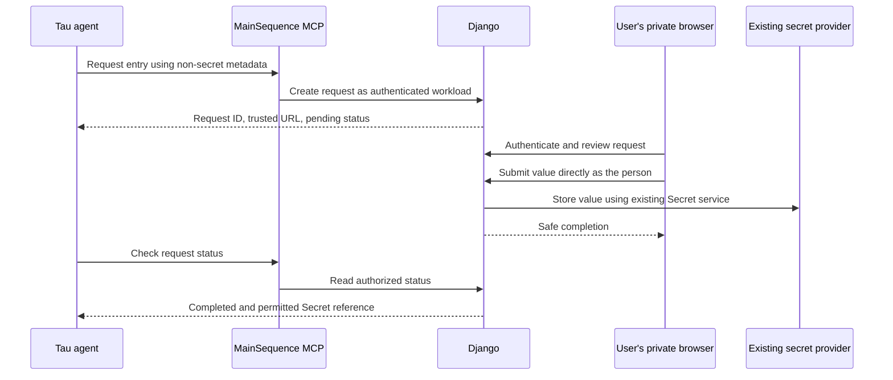

# ADR 0020: Secret Entry and Agent Access Boundaries

Status: Accepted — secure entry implemented in source on 2026-10-06 using the authenticated link/status fallback. Deployment and infrastructure verification remain operational prerequisites. Authentication and the direct Harness Agent Secret rule are governed by tdag-django ADR-0048.

Date: 2026-10-04

Reassessed: 2026-10-06

Owners: Main Sequence Platform, Users/Auth, Pod Manager, MCP Gateway, Command Center, and TAU SDK

## Decision summary

A user enters a Secret value in an authenticated MainSequence browser page that submits directly
to Django. Tau requests that interaction and receives only permitted metadata, status, and a
Secret reference. A model-facing tool must have no secret-value argument. Suppressing the
response cannot protect a value already supplied through the model.

The authentication prerequisite now exists. Each workload has its own workload User, platform
calls use that User's grants, and Django rejects direct Harness Agent reads and writes of Secret
values before accessing the provider. This ADR uses those controls; it does not propose another
principal, credential exchange, delegation system, or Secret capability layer.

The resulting guarantee is deliberately limited: the secure-entry flow keeps the submitted value
out of the agent channel, and the authenticated Harness Agent cannot read it back directly.
It does **not** guarantee that an agent can never obtain secrets through code it controls,
other workloads' outputs, its local human login, or credentials intentionally delivered to its
runtime. Those are material boundaries of the accepted architecture.

## Governing decisions

The earlier `tdag-django/docs/platform/runtime_identity_deployer_vs_runner_analysis.md` was
superseded and removed on 2026-10-04. Its successor is
`docs/platform/adr/adr-0048-workload-principals-and-runtime-authority-separation.md` in
`tdag-django`, now marked **Decided; implemented**, with amendments through 2026-10-06.
Use its current sections, not historical behavior tables or superseded amendments.

| Owner | Decisions this ADR consumes |
| --- | --- |
| Backend ADR-0048, sections 3–5, 9, 10, 12, and 14 | Workload Users, grants, Agent Secret rule, no delegation, infrastructure boundary, and rollout. |
| Backend ADR-0044 | Projected workload proof, token exchange, validation, expiry, and credential revocation. |
| Backend ADR-0049 | Named, Environment-scoped, shareable model-provider credentials and their intentional delivery to trusted runtimes. |
| This ADR | Secret entry outside the agent channel, safe tool contracts, human completion, and the precise non-disclosure claim. |

This reassessment incorporates the 2026-10-04 alignment into the body. The earlier proposals for
separate metadata/use/reveal/administration permissions, reviewed-code approval, delegated human
authority, and mandatory local protected execution are withdrawn. Child and edited workloads
follow ADR-0048's ordinary workload rules. Its 2026-10-05 amendment also withdrew dedicated runtime
and verifier ServiceAccounts; this ADR does not reinstate them.

## Pre-implementation gap analysis (2026-10-06)

Source baseline: `astro-tau` `c75b7bf`, `tdag-django` `26ec5b4a4`, and `CommandCenter` `d1882980`.
The baseline findings below precede this implementation; the implementation ledger follows. Live cluster admission, network policy,
cloud IAM, and the revisions serving production were not verified.

| Earlier gap | Current evidence | Assessment |
| --- | --- | --- |
| A runtime inherits its deployer's or the automation identity's broad authority. | `WorkloadUserService` creates a non-admin workload User with an unusable password. New release credentials name that User; JobRun issuance resolves the Job's User without falling back to the initiator. | Resolved in backend source. Reuse the authentication infrastructure. |
| A durable runtime bootstrap secret must be protected. | Backend authentication uses a pod-bound projected token and verifies its cluster and live owner chain. Backend bootstrap-secret code was removed. Tau rereads the projected token for each exchange and does not fall back after projected-proof failure. | Resolved for the current FastAPI/Harness deployment path. The runtime still holds usable credentials. |
| Hiding a Secret MCP tool leaves plaintext REST access available to the agent. | `SecretViewSet` rejects retrieve/create/partial-update for authenticated Harness runtimes. `SecretValueSerializer` also checks before `get_value()`. The decision uses authenticated runtime kind, not an agent-supplied flag. | Direct Secret access is now enforced in Django. Metadata remains available under normal visibility. |
| Secret grants and deletion need a second permission system. | Workload Users follow member rules and existing object/Environment grants; the Harness Agent value prohibition overrides those grants. Managed Secrets retain their owning-feature restriction. | No additional capability layer is needed or approved. |
| Users need a way to save a value during an agent conversation without sending it to the model. | Command Center already posts values directly to Django, but the inspected MCP catalog and UI contain no general Secret-entry request/completion flow. | Main remaining feature gap. Reuse storage and human submission, adding a correlated interaction. |
| Tau needs to present the interaction safely. | `MainSequenceMCPClient` constructs `ClientSession` without an elicitation callback; there is no Secret-entry integration in Tau. | URL elicitation and client presentation remain to be implemented. A safe authenticated link/status flow can precede negotiated support. |
| All credentials should remain invisible to agent execution. | Model-provider hydration deliberately returns credential material to the runtime under ADR-0049. Tau constructs provider clients with it and loads project extensions in that process. | Not an existing guarantee. Redacted representations and isolated pods do not isolate code from credentials in their own process. |
| A masked Secrets screen protects values from an agent-controlled browser. | Command Center fetches the selected Secret's value when its detail opens, before the user clicks Show. | Reuse the submit service, not that detail screen as the secure-entry boundary. |
| The generic MCP adapter safely handles credential-returning operations. | `agent_session.resolve_runtime_access` remains an approved token-returning exception for direct-runtime clients. Tau leaves it out of the model's tool catalog (`CREDENTIAL_RESULT_MCP_TOOLS`), so its token never becomes an `AgentToolResult`. | Resolved in Tau for the model channel. Code in Tau's process and direct-runtime clients can still obtain the token. |
| Authentication proves the production sandbox is correctly configured. | ADR-0048 assigns network isolation, controller-chain admission, and metadata-service restrictions to infrastructure. Its cluster inventory is historical. | Deployment evidence is still required; token implementation alone does not establish those controls. |

### What the new authentication protects

FastAPI and Harness Agent revisions exchange a Kubernetes token with audience
`mainsequence-runtime-exchange` and a lifetime of at most ten minutes for a platform JWT of at
most fifteen minutes, without a refresh token. Django validates the token and the Pod's owner
chain against the release revision. Runtime JWTs work on DRF and MCP through the canonical
authenticator, preserving the runtime context and Environment boundary.

Jobs are different: they retain per-run, access-only session JWTs lasting up to 24 hours, now
issued for the Job's workload User. Do not describe every workload credential as a fifteen-minute
projected-token exchange.

The principal identifies whose grants apply. The Harness runtime classification supplies the
additional direct Secret prohibition. Neither a Secret grant nor knowledge of a UID bypasses it.
New revisions use the workload principal; current code refuses redeployment/reactivation of a
revision whose credential names another principal. Inspect active deployments before making a
claim about production coverage.

### What it does not protect

**Agent-editable workloads.** A Job or service launched by an agent runs as its own workload User.
It does not inherit the parent's Secret grants. However, if that Job already has a Secret grant,
an agent that can change its code can make it read the value and emit it in a log, artifact, or
response. Repository, branch, or Project edit access can confer that ability too. This is an
explicit ADR-0048 trust decision, not an unimplemented reviewed-code approval feature.

Therefore, keep a Secret away from workloads whose code the agent can change when that Secret
must remain unknown to the agent. A legitimate consumer must also avoid publishing values in
outputs the agent can read. Granting a workload a Secret trusts its code and everyone able to
modify that code.

**Local human authority.** A local coding agent using a person's login acts as that person. The
backend cannot infer that a request with that login was generated by an LLM. The Harness runtime
rule does not turn local human credentials into a restricted principal.

**Credentials inside Tau.** Provider credentials are a separate resource from the platform's
`Secret` objects. ADR-0049 expressly permits authorized recipients to receive and copy them in
their runtime. Sessions served for a person retain their existing provider-account rules; an
autonomous workload uses configured providers shared with it. The direct Secret prohibition does
not forbid provider hydration. Code with access to Tau's process can also access its runtime
credential. Hiding values from `repr()`, logs, or tool names does not prevent that access.

**Browser observation and deliberate disclosure.** If the agent can inspect the entry browser's
DOM, network, or screen, an out-of-band form alone is insufficient. A user who pastes a value into
chat has already disclosed it. This flow cannot undo that exposure.

## Secure-entry flow

### 1. Tools request entry and read status

Provide narrow start, status, and cancel operations, plus permitted metadata discovery. The
implemented names are `secret_entry.start`, `secret_entry.status`, `secret_entry.cancel`, and
`secret.list`; canonical DRF routes and closed schemas are documented in the backend
`docs/mcp/implementation/secret_entry.md` contract. No tool accepts `value`, credentials, raw
request bodies, arbitrary callback URLs, or secret-bearing form responses. The human submit operation is not a model tool.

A start request may carry a logical name or existing Secret UID, purpose, and intended consumer
reference. Django derives the requester and runtime Environment from authenticated context.
Bind a conversation or intended human only through existing backend-verified session ownership
and caller proofs; a model-supplied user UID does not establish either. These facts associate the
interaction with a user; they do not delegate that user's authority to the workload.

Return only an opaque request ID, a trusted MainSequence entry URL, expiry, and safe status.
Possession of the URL or reference grants no authority. Authenticate and authorize every status,
cancel, and submit operation. Only return the resulting Secret metadata/reference when the caller
is permitted to see it. Do not route metadata reads through the plaintext detail serializer.

### 2. The person submits directly to Django

The entry page identifies the requesting agent, Secret, Environment, purpose, and intended
consumer. The authenticated person must have the existing create/update authority. Django performs
the write as that person; the agent's runtime token is not exchanged for a human credential.

Reuse the existing provider-backed Secret provision/update services. Preserve managed-Secret
restrictions. If access must be granted to a consumer, show that separately and use the existing
sharing rules, with current authorization. Saving does not implicitly grant access to the
requesting Harness Agent or every workload in the branch. A failed share must not be represented
as a failed save that encourages another unnecessary provider version.

The entry surface must be outside agent browser control and capture. Submit over TLS with the
platform's browser authentication and CSRF protections. Keep values out of URLs, analytics,
session replay, request-body logging, browser persistence, chat state, and error messages. Use
`no-store`, a restrictive referrer policy, and clear form state on completion/cancellation.
Creation and rotation must not hydrate the previous value or navigate automatically to a
plaintext-fetching detail view.

Use existing OAuth/provider sign-in when appropriate. This feature does not duplicate the
model-provider credential store or change ADR-0049's delivery policy.

### 3. Django owns completion

Keep durable, non-secret request state: requester, verified conversation association if present,
Environment, intended operation/consumer, expiry, outcome, and permitted result reference. Reuse
an existing domain operation/requirement where suitable; do not introduce a generic operation
framework just for MCP. The request must never store the submitted value, an encoded copy, or a
value preview.

Submission rechecks authority and atomically claims the pending request. Duplicate submissions,
expiry, cancellation, and reconnects must have a consistent outcome. Provider writes and Django
transactions are separate: use a non-secret operation receipt to reconcile uncertain writes,
and never persist plaintext in a retry queue. Report completion only when storage is confirmed.
Cancellation after a confirmed save does not silently delete the Secret.

Browser navigation acceptance, a completion notification, and an agent's statement that it is
done are not evidence of storage. Read Django status before continuing. Retry of the conversation
must not repeat the write or a downstream business operation.

### 4. Present the request using standard client behavior

Prefer negotiated [MCP URL-mode elicitation](https://modelcontextprotocol.io/specification/2025-11-25/client/elicitation).
It directs sensitive interactions outside the MCP client; form elicitation must not collect
passwords or keys. Advertise URL support only when the attached client implements it, display the
server and destination, and obtain the user's navigation consent. A client without this support
may display the authenticated link and poll status. It must never fall back to asking for the
value in chat.

Tau must correlate the interaction with the correct conversation and authenticated viewer,
including when sessions share an MCP connection. Only safe action/status data belongs in model
context, tool details, events, history, snapshots, and inspection. Command Center or Tau Board
presents the link; it does not proxy or cache the submission.

For an A2A Task, use the existing `auth_required`/requirement mechanism when the backend provides
the required reference. Ordinary chat also needs a pending action and verified resumption;
A2A task interruption alone does not supply it. A headless caller returns pending/unsupported
status with the safe completion path rather than soliciting plaintext.

### 5. Consume a Secret through an authorized business operation

The agent may supply a reference and business parameters to a backend operation that resolves a
Secret internally and returns only the business result. Existing object and Environment
permissions remain authoritative. Each operation controls credential placement, destinations,
redirects, and response/error projection so the caller cannot turn it into a plaintext export.

Do not add a generic decrypt tool, secret-interpolating shell, or arbitrary authenticated HTTP
proxy as the implementation of safe use. Reuse existing service boundaries; a new vault or broker
service is not required. These narrow operations apply the independent authorization and minimum
privilege practices described in [OWASP Excessive Agency](https://genai.owasp.org/llmrisk/llm062025-excessive-agency/).

Ordinary workloads retain their existing right to retrieve granted Secrets. This ADR neither
creates a separate use permission nor blocks all agent-authored Jobs. When a consumer must keep
its values unknown to an agent, the consumer's code and outputs must satisfy the trust boundary
above. Stronger enforcement would require a separate owner decision changing ADR-0048.

## Implementation ledger (2026-10-06)

| Owner | Implemented behavior |
| --- | --- |
| tdag-django Secrets | `SecretEntryRequest` migration and canonical start/status/cancel/human-submit actions. Current human and Environment authorization, managed-Secret refusal, durable submission claim, private provider receipt, safe uncertain outcome, and permission-filtered result reference. Existing provider services perform storage. |
| tdag-django MCP | `secret.list` and the three entry tools, closed value-free schemas, canonical DRF projection, private caller-session proof, and amended ADR-0028. The active-session validator now belongs to the agent domain and is shared with MCP. There is no model-facing submit operation. |
| Tau | Host-owned idempotency keys bound to session/tool call, strict status validation that discards free-form MCP text, safe links, and A2A `auth_required` references. Only validated metadata is persisted in `mainsequence.secret_entry` custom entries. Before a resumed turn, Tau rechecks pending/submitting entries using that conversation's current proof; failed verification stops model execution. No downstream business operation is automatically replayed. |
| Command Center | Dedicated authenticated private page selected by request and exact Environment UIDs. Uncontrolled value field, direct Django POST with no auth replay or request-trace scope, clearing on submission/cancel/unmount/page hide, status refresh, and no old-value hydration or automatic detail navigation. Sharing remains separate. |

This implementation selects the ADR's authenticated **link/status fallback**. It does not
advertise MCP URL elicitation support. A person opens the link outside agent browser control and
capture; the page cannot enforce an operating-system boundary against software observing it.
Only the non-secret request and Environment UIDs are carried in its URL.

A request expires after 30 minutes. The backend commits a `submitting` claim before one
application-level value-write attempt. A duplicate completed submission returns status; an
in-flight duplicate or cancellation cannot repeat or undo the write. A provider failure or an
abandoned submission checked after ten minutes becomes `storage_outcome_unknown`. The provider
and Django are not a shared transaction: missing receipts require operator reconciliation using
request/Secret identity and provider version metadata. Do not reset an uncertain request or
silently retry its value. Creation may leave an empty metadata reservation. This is not a
provider-side exactly-once guarantee.

The backend contract includes rollout and reconciliation instructions. Deploy Pod Manager
migration `0018_secret_entry_request` and the backend, UI, and Tau changes together; implementation
applied the migration only to local `test_postgres`. No production migration, live provider write,
or cluster validation was performed.

Integration owners still control credential placement, allowed destinations and safe output for
each business operation. Runtime/infrastructure owners still verify deployed workload/revision
coverage and ADR-0048 admission, network and metadata-service controls. These are continuing trust
obligations, not a new authentication plan. Native URL elicitation can follow when both server and
client implement its negotiated contract.

### Separate credential-output concern

Backend ADR-0028 intentionally exposes a short-lived token from
`agent_session.resolve_runtime_access` for direct-runtime clients. Tau's generic `_tool_result`
copies MCP text and structured output into agent-visible content and details, which reach UI
events, history, and persistence, so `AgentToolResult.details` is not private storage.

Tau therefore does not offer this operation as a model tool. Nothing in Tau needs the token:
agent-to-agent turns use `a2a.send_message`, which the backend mediates with caller-session proof.
Excluding the operation from the catalog keeps the token out of model requests, tool content and
details, events, history, snapshots, and error/cancellation paths. The approved direct-client
contract is unchanged. A future model need for runtime readiness requires a status-only operation
that returns no credential, not re-exposure of this one.

This boundary covers the model channel only. Code running in Tau's process can still call the
operation with the runtime credential, and ADR-0049's provider delivery remains a separate,
accepted exception. Neither is solved by workload identity or token expiry.

## Evidence and acceptance

Backend source locations are relative to `tdag-django`:

| Behavior | Evidence |
| --- | --- |
| Workload principal creation and selection | `timeseries_orm/tdag/pod_manager/services/workload_users.py`; `services/jobs/runtime_auth.py` under the same Pod Manager package; `tests/test_workload_users.py`. |
| Pod-bound proof and runtime classification | `timeseries_orm/tdag/pod_manager/services/runtime/knative/workload_identity.py`, `credentials.py`, and `request_auth.py`; `tests/test_runtime_workload_identity_verification.py` and `test_runtime_projected_deployment.py`. |
| Direct Secret prohibition and retained human access | `timeseries_orm/tdag/pod_manager/views/core.py`, `serializers.py`, and `tests/test_agent_secret_rule.py`. Existing tests assert denial before `Secret.get_value()` and preserve metadata/human behavior. |
| MCP reuses runtime context | `timeseries_orm/mcp_gateway/authentication/tracked_jwt.py` and `tests/test_workload_runtime_jwt.py`. |
| Provider hydration | `timeseries_orm/agents/model_provider_credentials.py`, `resolve_operation_context()` and `hydrate()`. |
| Token-returning MCP exception | `timeseries_orm/mcp_gateway/protocol/registry.py`, `schemas.py`, `results.py`, and `tools/agents.py`. |

Tau evidence: [runtime authentication](../../src/ms_tau_sdk/backend/auth.py),
[MCP transport](../../src/ms_tau_sdk/backend/mcp.py),
[result projection](../../src/ms_tau_sdk/tools/mainsequence_mcp.py),
[provider construction](../../src/ms_tau_sdk/providers/factory.py),
[tool and extension composition](../../src/ms_tau_sdk/runtime/manager.py),
[stream encoding](../../src/ms_tau_sdk/protocols/assistant_ui.py),
[session persistence](../../src/ms_tau_sdk/sessions/storage.py), and
[snapshots](../../src/ms_tau_sdk/runtime/snapshots.py).
Command Center evidence is
`apps/mainsequence-foundry/src/extensions/workbench/features/secrets/MainSequenceSecretsPage.tsx`.

The initial reassessment ran 63 existing Tau checks. Implementation additionally verified:

- Pod Manager: 26 scoped tests, including request lifecycle, Secret mutation compatibility and
  the existing direct Harness rule.
- MCP: 69 scoped tests, including real workload JWTs, active/wrong/stale caller proofs,
  conversation and Environment isolation, output permissions, catalog/schema parity and dependency
  direction; 20 existing A2A/session-authorization compatibility tests also pass.
- Tau: 68 focused entry, adapter, runtime-manager and documentation tests; Ruff and strict mypy.
  Entry tests cover forbidden arguments/results, private proof, persisted correlation, backend
  status refresh on reconnect and failure without exposing transport content.
- Command Center: 12 focused tests and the Foundry TypeScript check, including direct value POST,
  no authentication replay, safe errors, cancellation and no plaintext detail fetch.

Provider IO is mocked with synthetic values. Runtime authentication tests use signed workload
JWTs and canonical DRF authentication; artifact provenance and TestCase connection cleanup are
mocked. These are source-level and local integration checks, not evidence about live cloud IAM,
ingress body capture, browser isolation or production versions.

Retain these acceptance requirements in regression and deployment validation:

1. A synthetic value submitted in the private browser reaches Django/provider storage and is
   absent from model requests, MCP inputs/results, SSE, histories, snapshots, logs, and errors.
2. A real Harness runtime JWT is denied on Secret GET/HEAD, POST, and PATCH before provider
   access, even with a Secret grant. Cover serializer reuse and every added plaintext path;
   existing mocked classification tests alone do not exercise the authentication-to-view chain.
3. Human and ordinary workload access, metadata visibility, member deletion, managed-Secret
   restrictions, and Environment isolation retain their accepted behavior.
4. Wrong-user, wrong-session, cross-Environment, expired, replayed, cancelled, and duplicate
   submissions cannot complete another request or duplicate the write. Uncertain provider outcomes
   never produce a false success or plaintext recovery record.
5. Browser acceptance alone cannot resume success. Reconnects and concurrent conversations preserve
   correlation. Unsupported clients never request a secret in chat or form elicitation.
6. Each business consumer's success/error/log/artifact paths exclude credentials and cannot send
   them to a caller-selected destination. Check workload code-edit grants as well as Secret grants.
7. Any claim about broader credential non-disclosure keeps the runtime-access result path out of
   the model catalog (covered by `tests/unit/test_mainsequence_mcp.py`) and states ADR-0049's
   runtime-delivery exception. Any hosted isolation claim has cluster
   evidence; any local human-login run is clearly outside the Harness-only guarantee.

## Consequences

The implemented feature reuses established authentication, sharing and Secret storage. It
provides human-to-Django submission and a reference-only continuation for the agent. No principal
redesign is needed.

The limitation remains consequential: stronger service authentication narrows authority, but
secrecy also depends on where values are delivered and who can change the receiving code. The
product must describe the direct Harness Secret protection accurately rather than promise that
all agent-controlled execution is incapable of obtaining credentials.
