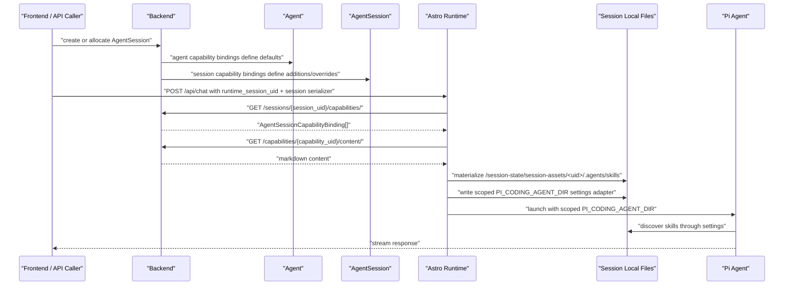

# ADR 32: Agent and Session Capability Bindings

Status: Accepted
Date: 2026-06-14
Implementation Status: Astro runtime skill materialization implemented in 2.0.3. Backend
capability management and frontend editing flows are external contracts.

## Context

Astro needs a way to expose reusable markdown capabilities from backend-created agents and
agent sessions without mutating the built image, the prepared project checkout, or fixed agent
definitions.

The backend contract is capability-based:

- `AgentCapability` is the reusable resource.
- Agent capability bindings attach capabilities to an `Agent`.
- Agent session capability bindings attach capabilities to an `AgentSession`.
- Agent capabilities are the default capabilities of the agent.
- Session capabilities are session-local additions or overrides.
- Normal agent discovery uses agent capability bindings, not session capability bindings.

This replaces the earlier `skill_assets` JSON-field idea. Dynamic markdown should not be modeled as
mutable `Agent.skill_assets`, because that blurs fixed coding-agent definitions. The reusable
capability resource and binding rows are the durable contract.

## Problem

Agents already have capabilities by design as part of their coding-agent definition, image,
repository scaffold, and runtime contract. Runtime customization still needs a precise place to add
session-specific behavior.

The design must guarantee that:

- fixed agent capabilities are inspectable and discoverable
- session capabilities are scoped to one backend `AgentSession.uid`
- session materialization never writes back into the image, package, project checkout, or fixed
  `.agents/skills/` source scaffold
- one session cannot contaminate another session's materialized capability files
- the frontend can classify capabilities from repository sync versus extra/manual/API/session
  bindings

## Decision

Use reusable `AgentCapability` rows plus binding rows.

- Agent bindings define the agent's default capabilities.
- Session bindings define session-local additions or overrides.
- Astro must fetch and respect the backend binding contract instead of expecting inline
  `skill_assets` fields.
- For current Astro runtime materialization, only `kind="skill"` is materialized into
  `.agents/skills/`.
- Backend/frontend capability contracts may include `kind="prompt"` and `kind="extension"`, but
  prompt runtime materialization is outside this ADR until Astro has a standard prompt discovery
  adapter.
- `.pi` remains the Pi runtime adapter. `.agents/skills` is the inspectable skill materialization
  shape.

For coding agents, repository-synced agent capability bindings are the fixed definition baseline.
Extra/manual/API capability bindings should normally be attached to sessions when the intent is
per-run customization.

Repository-sourced capabilities must not be copied into session bindings just to repeat the agent
defaults. If either the binding or the reusable capability has `source_type="repository"`, Astro
treats it as fixed/repetitive for session overlay materialization. Session bindings should contain
only true session-local additions or overrides.

## Capability Types

Capabilities are reusable resources. Bindings attach them to an agent or a session.

```ts
type AgentCapabilityKind = "skill" | "prompt" | "extension";

type AgentCapabilitySourceType =
  | "inline"
  | "registry"
  | "repository"
  | "api"
  | "external";
```

Current backend behavior:

- `skill` is supported.
- `prompt` is supported by the backend/frontend contract.
- `extension` exists in the enum, but create/update is rejected for now.

`source_type` semantics:

- `inline` means user/client-created inside the platform.
- `registry` means from a future/shared registry.
- `repository` means synced from repo agent card plus markdown `ProjectResource`.
- `api` means API-provided capability.
- `external` means external system reference.

## Standalone Capability Contract

Standalone endpoints:

```text
GET    /orm/api/agents/v1/capabilities/
POST   /orm/api/agents/v1/capabilities/
GET    /orm/api/agents/v1/capabilities/{capability_uid}/
PATCH  /orm/api/agents/v1/capabilities/{capability_uid}/
DELETE /orm/api/agents/v1/capabilities/{capability_uid}/
GET    /orm/api/agents/v1/capabilities/{capability_uid}/content/
PUT    /orm/api/agents/v1/capabilities/{capability_uid}/content/
```

List filters:

```text
GET /orm/api/agents/v1/capabilities/?kind=skill
GET /orm/api/agents/v1/capabilities/?source_type=repository
GET /orm/api/agents/v1/capabilities/?is_editable=false
```

Capability shape:

```ts
type AgentCapability = {
  uid: string;
  name: string;
  kind: "skill" | "prompt" | "extension";
  source_type: "inline" | "registry" | "repository" | "api" | "external";
  source_ref: string;
  capability_path: string;
  is_editable: boolean;
  description: string;
  metadata: Record<string, unknown>;
  content_file: string | null;
  content_sha256: string;
  content_mime_type: string;
  content_size: number;
  has_content: boolean;
  created_by_user_uid: string | null;
  updated_at: string;
};
```

Create/PATCH writable subset:

```ts
type AgentCapabilityWrite = {
  name: string;
  kind: "skill" | "prompt";
  source_type?: "inline" | "registry" | "repository" | "api" | "external";
  source_ref?: string;
  capability_path?: string;
  is_editable?: boolean;
  description?: string;
  metadata?: Record<string, unknown>;
};
```

`capability_path` is the nested path for UI grouping, for example:

```text
skills/trading_skills/rebalance/SKILL.md
prompts/research/PORTFOLIO_REVIEW.md
```

Capability content:

```ts
type AgentCapabilityContent = {
  content: string;
  content_sha256: string;
  content_mime_type: string;
  content_size: number;
};

type AgentCapabilityContentWrite = {
  content: string;
  filename?: string;
  content_mime_type?: string;
};
```

`filename` must end in `.md` or `.markdown`. `content_mime_type` must be `text/markdown`,
`text/x-markdown`, or `text/plain`. Only `is_editable=true` capabilities can update content.

## Agent Capability Bindings

Agent endpoints:

```text
GET  /orm/api/agents/v1/agents/{agent_uid}/capabilities/
POST /orm/api/agents/v1/agents/{agent_uid}/capabilities/bind/
POST /orm/api/agents/v1/agents/{agent_uid}/capabilities/unbind/
POST /orm/api/agents/v1/agents/{agent_uid}/capabilities/sync-from-card/
```

The list response returns `AgentCapabilityBinding` rows. Each row includes both the binding and the
nested reusable capability.

```ts
type AgentCapabilityBinding = {
  uid: string;
  agent_uid: string;
  capability_uid: string;
  capability: AgentCapability;
  role: string;
  sort_order: number;
  is_enabled: boolean;
  is_locked: boolean;
  configuration: Record<string, unknown>;
  source_type: "inline" | "registry" | "repository" | "api" | "external";
  source_ref: string;
  updated_at: string;
};
```

Example:

```json
{
  "uid": "binding_uid",
  "agent_uid": "agent_uid",
  "capability_uid": "capability_uid",
  "capability": {
    "uid": "capability_uid",
    "name": "Rebalance Portfolio",
    "kind": "skill",
    "source_type": "repository",
    "source_ref": "...",
    "capability_path": "skills/trading_skills/rebalance/SKILL.md",
    "is_editable": false,
    "description": "...",
    "metadata": {},
    "content_sha256": "...",
    "content_mime_type": "text/markdown",
    "content_size": 1234,
    "has_content": true,
    "created_by_user_uid": "user_uid",
    "updated_at": "..."
  },
  "role": "",
  "sort_order": 0,
  "is_enabled": true,
  "is_locked": false,
  "configuration": {},
  "source_type": "repository",
  "source_ref": "...",
  "updated_at": "..."
}
```

Bind request:

```ts
type CapabilityBindRequest = {
  capability_uid: string;
  role?: string;
  sort_order?: number;
  is_enabled?: boolean;
  is_locked?: boolean;
  configuration?: Record<string, unknown>;
  source_type?: "inline" | "registry" | "repository" | "api" | "external";
  source_ref?: string;
};
```

Unbind request:

```ts
type CapabilityUnbindRequest = {
  capability_uid: string;
};
```

## Session Capability Bindings

Session endpoints:

```text
GET  /orm/api/agents/v1/sessions/{session_uid}/capabilities/
POST /orm/api/agents/v1/sessions/{session_uid}/capabilities/bind/
POST /orm/api/agents/v1/sessions/{session_uid}/capabilities/unbind/
```

Session list response items have `agent_session_uid` instead of `agent_uid`:

```ts
type AgentSessionCapabilityBinding = {
  uid: string;
  agent_session_uid: string;
  capability_uid: string;
  capability: AgentCapability;
  role: string;
  sort_order: number;
  is_enabled: boolean;
  is_locked: boolean;
  configuration: Record<string, unknown>;
  source_type: "inline" | "registry" | "repository" | "api" | "external";
  source_ref: string;
  updated_at: string;
};
```

Example:

```json
{
  "uid": "session_binding_uid",
  "agent_session_uid": "session_uid",
  "capability_uid": "capability_uid",
  "capability": { "...": "same AgentCapability shape" },
  "role": "",
  "sort_order": 0,
  "is_enabled": true,
  "is_locked": false,
  "configuration": {},
  "source_type": "inline",
  "source_ref": "",
  "updated_at": "..."
}
```

Session bind/unbind requests use the same request shapes as agent bind/unbind.

Important distinction:

- Agent capabilities are the default capabilities of the agent.
- Session capabilities are session-local additions or overrides.
- Normal agent discovery uses agent capability bindings, not session capability bindings.

## Frontend Classification

The client should classify capability origin by comparing the reusable capability source with the
binding source.

```ts
const isRepoCapability =
  binding.capability.source_type === "repository";

const isRepoProjectedBinding =
  binding.source_type === "repository" &&
  binding.capability.source_type === "repository";

const isExtraBinding =
  binding.source_type !== "repository";
```

Use this UI language:

- "From repo" means `isRepoProjectedBinding`.
- "Extra/manual/session/API/etc" means `isExtraBinding`.
- Do not add repository-sourced agent bindings to a session to represent defaults already present
  on the agent.
- Capability content origin is `binding.capability.source_type`.
- Binding origin is top-level `binding.source_type`.
- Use `capability.capability_path` to render nested structure such as
  `skills/trading_skills/rebalance/SKILL.md`.

Repository capability handling:

- `binding.source_type === "repository"` means the binding came from repo sync.
- `binding.capability.source_type === "repository"` means the reusable capability content came from
  repo/agent-card sync.
- Repository-projected agent bindings are fixed defaults and should be rendered as agent defaults,
  not session additions.
- Session bindings should not be created for repository-sourced defaults already available through
  the agent binding list.
- If a session needs to change behavior relative to a repository capability, represent that as an
  explicit non-repository session binding or override, not as a duplicate repository binding.

## Runtime Materialization

Astro materializes enabled session skill bindings under session-local state. It must not write them
under the shared Astro `.pi` runtime copy or directly into the project source tree.

```text
/session-state/session-assets/<agent_session_uid>/
  .agents/
    skills/
      ...
```

For materialization:

- Include enabled session bindings where `capability.kind === "skill"`.
- Exclude repository-sourced bindings from session overlay materialization; those are already
  provided by fixed agent/project skill discovery.
- Fetch content through `GET /orm/api/agents/v1/capabilities/{capability_uid}/content/` when
  `capability.has_content` is true.
- Use `capability.capability_path` to preserve nested skill structure when it is valid and
  path-safe.
- Reject or ignore paths that are absolute, contain `..`, contain empty segments, contain hidden
  path segments, or escape the session asset root.
- Generate a session-local scoped `PI_CODING_AGENT_DIR` settings adapter that exposes materialized
  session skills to Pi.
- Layer fixed agent/project skills and session overlay skills without mutating fixed sources.

Prompt and extension capabilities are not materialized by this ADR.

## Isolation Rules

Session capability materialization must be isolated by backend `AgentSession.uid`.

- Fixed image, package, and project scaffold skill trees are read-only inputs at session launch.
- Astro must never write session capability content into the built image, prepared project checkout,
  or fixed `.agents/skills/` source scaffold.
- Astro must write session skill capabilities only under
  `/session-state/session-assets/<agent_session_uid>/.agents/skills/`.
- Astro must never reuse a materialized skill directory from a different `AgentSession.uid`.
- If a session is rematerialized, Astro may replace only that same session's materialized skill
  root after validating the target path is inside the session asset root.
- Skill collisions between fixed skills and session overlay skills must be handled deterministically
  without modifying the fixed skill source. The selected precedence rule must be logged.
- Checkpointing and history hydration must preserve session capability bindings by session
  identity, not by mutable runtime path.

## Launch Flow



## `.agents` Scaffolding

The deployment scaffolder should treat `.agents/skills` as the fixed agent-facing skill contract.

```text
.agents/
  agent_card.json
  skills/
    trading_skills/
      rebalance/
        SKILL.md
```

The scaffolder should:

- create `.agents/agent_card.json` for agent identity and discovery metadata
- create `.agents/skills/` only when it is missing
- preserve existing `.agents/skills/` content from the project image
- sync repository skills into `AgentCapability` plus `AgentCapabilityBinding` rows through
  `/agents/{agent_uid}/capabilities/sync-from-card/`
- set repository-synced capability and binding `source_type` to `repository`
- keep `.pi` generation separate from `.agents` authoring

The scaffolder should not:

- delete or overwrite an existing `.agents` tree
- write session capability content directly into `.pi`
- write session capability content into fixed image, package, project, or scaffold paths
- create runtime provider auth files
- install dependencies
- create environment-variable or model-binding policy
- mutate an existing project checkout during session launch

If the prepared project image already contains `.agents/skills/`, Astro must leave those
project-image files untouched. Session materialization happens in `/session-state`, and the Pi
adapter layers session materialized skills alongside fixed project-image `.agents/skills` without
writing back into the project checkout.

## Non-Goals

This ADR does not:

- add `Agent.skill_assets` or `AgentSession.skill_assets`
- allow users to override `.pi/APPEND_SYSTEM.md`
- materialize prompt capabilities into a runtime prompt adapter
- materialize extension capabilities
- introduce arbitrary runtime file mounts
- install Python, Node, system, or Pi dependencies
- add new tool permissions
- change model binding or provider credential behavior
- change A2A envelope semantics
- make frontend request payloads authoritative for capability bindings
- mutate the project checkout during session launch

## Implementation Tasks

- [x] Replace ADR-era `skill_assets` assumptions with capability and binding endpoints.
- [x] Add Astro client support for `GET /orm/api/agents/v1/agents/{agent_uid}/capabilities/`.
- [x] Add Astro client support for `GET /orm/api/agents/v1/sessions/{session_uid}/capabilities/`.
- [x] Add Astro client support for `GET /orm/api/agents/v1/capabilities/{capability_uid}/content/`.
- [x] Materialize only enabled session bindings where `capability.kind === "skill"`.
- [x] Skip repository-sourced bindings when building session overlays so fixed agent skills are
      not duplicated into session state.
- [x] Validate `capability.capability_path` before writing files.
- [x] Materialize session skills only under
      `/session-state/session-assets/<agent_session_uid>/.agents/skills/`.
- [x] Enforce that rematerialization writes only inside the current session asset root.
- [ ] Add deterministic collision handling for fixed skills versus session overlay skills without
      mutating fixed skill source trees.
- [x] Generate a session-local scoped `PI_CODING_AGENT_DIR` settings adapter that exposes
      materialized session skills to Pi.
- [x] Ensure provider credential session overlays and capability overlays compose into one scoped
      `PI_CODING_AGENT_DIR` without losing auth files or settings overrides.
- [x] Store materialized capability metadata in Astro session metadata and checkpoint bundles.
- [x] Add logs for materialized capability counts, source classification, and materialization path.
- [x] Add tests for agent capability binding classification.
- [x] Add tests for session capability binding parsing.
- [x] Add tests that repository-sourced agent defaults are not duplicated into session
      capabilities or session materialization.
- [x] Add tests that one session's capability materialization does not leak into another session.
- [ ] Add tests that session materialization does not overwrite prepared project-image
      `.agents/skills/`.
- [ ] Add tests that rematerialization can only replace the current session's own skill root.
- [ ] Add tests for invalid `capability_path` values and unsupported capability kinds.
- [ ] Add docs for `.agents/skills/` authoring and backend sync/import behavior.

## Consequences

### Positive

- Fixed agent defaults and session-local customization are represented by the same binding model.
- Frontend can classify repository capabilities versus extra/manual/API/session bindings
  deterministically.
- Runtime launch remains deterministic because Astro materializes backend-owned session capability
  bindings into a session-owned filesystem root.
- Fixed image/project skills remain read-only.

### Costs

- Astro needs a backend capability client instead of inline session asset parsing.
- Session launch gains capability list and content fetch steps.
- Scoped Pi agent directory composition becomes more important because provider auth, settings
  overrides, and session capability overlays may all need to coexist.
- Prompt capabilities exist in the backend contract but need a separate Astro runtime adapter before
  they can be materialized.

## Follow-Up Questions

- Should session capability binding snapshots be included in checkpoint bundles, or is backend
  session hydration enough?
- What is the exact precedence rule when a fixed skill and session overlay skill resolve to the
  same `capability_path`?
- Should Astro cache capability content by `content_sha256` inside a session root, or always fetch
  on materialization?
