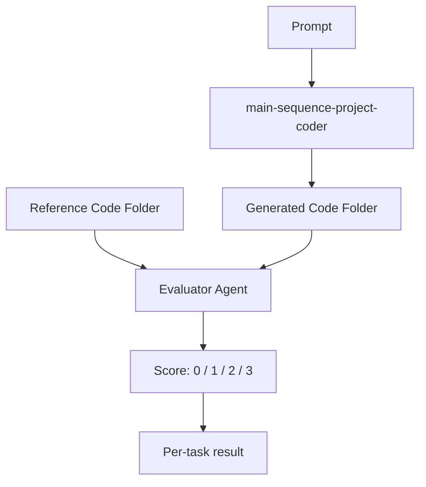
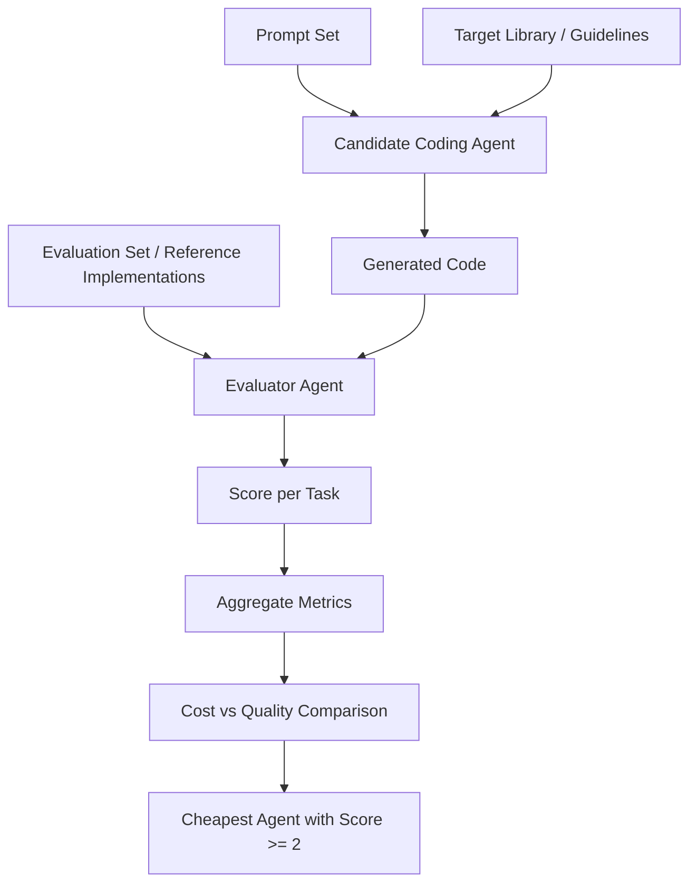

# Research Problem: Cost-Effective Agent Evaluation for Code Generation

## Problem Statement

We want a repeatable way to identify the **cheapest coding agent** that can complete a code-generation task at an acceptable quality level.

We start with a specific example: an agent called **`main-sequence-project-coder`**. This agent takes a prompt and generates a full code folder that is intended to satisfy the prompt and follow **MainSequence library guidelines**.

A second, stronger evaluator agent then compares the generated code against our reference implementation and assigns a score. This gives us a concrete **Agent / Evaluator** setup that can later be generalized into a broader experiment where the output is code.

For **`main-sequence-project-coder`**, we will provide **several prompts and project examples**.

the first test prompt is:

`Build me a project that replicates the tutorial project in https://github.com/mainsequence-sdk/mainsequence-sdk/tree/main/docs`

The result here can be easily compared with the repository here :https://github.com/mainsequence-projects/introduction-tutorial

The next prompt and project will be shared as public repos in the following organization. 
https://github.com/mainsequence-projects each project will also include the prompt to generate the project. 

The current Astro agent its an orchestrator agent but for this evaluation we only care about  the main-sequecne-project-coder agent.

## Particular Example: `main-sequence-project-coder`

### Inputs

- Prompt describing the coding task
- MainSequence library guidelines
- Reference project or code folder

### Output

- A full generated code folder representing the prompt intent and following MainSequence conventions

### Evaluation
**this is where Know center expertise will be very valuable in desgigng the expriment, the evaluation measure, etc**
A secondary evaluator agent compares:

- the **generated code folder**, and
- **our version of the code**

The evaluator assigns a score using a stronger model, such as **GPT-5.4** or a top Anthropic model.

### Proposed Scoring Scale

- **0** — Does not fulfill the task
- **1** — Fulfills the task, but needs significant improvements
- **2** — Fulfills the task
- **3** — Fulfills the task and improves on the expected solution

## Particular Example Workflow

## Generalized Experiment

We want to generalize this into an **Agent / Evaluator experiment for code generation**.

### Experiment Inputs

- A set of prompts
- A target coding library or framework
- An evaluation set
- A set of candidate coding agents or models
- A strong evaluator model

### Experiment Goal

1. Find the **cheapest LLM-based coding agent** that can perform the task.
2. Build a **repeatable and measurable process** for identifying the cheapest agent that scores **at least 2**.

## Research Objective

The objective is not only to compare models on quality, but to compare them on **cost-adjusted usefulness**.

The key question is:

> What is the cheapest coding agent that can reliably achieve a score of **2 or higher** on the evaluation set?

## Measurement Framework

For each candidate coding agent, we run the same evaluation process across the same prompt set and measure:

- Score per task
- Average score
- Distribution of scores
- Percentage of tasks scoring **2 or higher**
- Cost per run
- Total cost across the evaluation set
- Cost per acceptable result

## Success Criterion

An agent is acceptable if it:

- achieves a score of **2 or higher**,
- does so reliably across the evaluation set, and
- is cheaper than alternative agents with similar quality.

The preferred agent is the **lowest-cost agent** that still meets the target quality threshold.

## Generalized Workflow

## Expected Outcome

The outcome of this research should be a standard evaluation framework for code-generation agents that allows us to:

- test multiple coding agents on the same benchmark,
- evaluate them with a consistent judging process,
- measure both **quality** and **cost**, and
- select the **cheapest acceptable agent** for a given coding domain.

## Deliverable

A reusable **Agent / Evaluator experiment framework** for code generation, starting with **`main-sequence-project-coder`** and extending to any coding library, prompt suite, or evaluation set.
