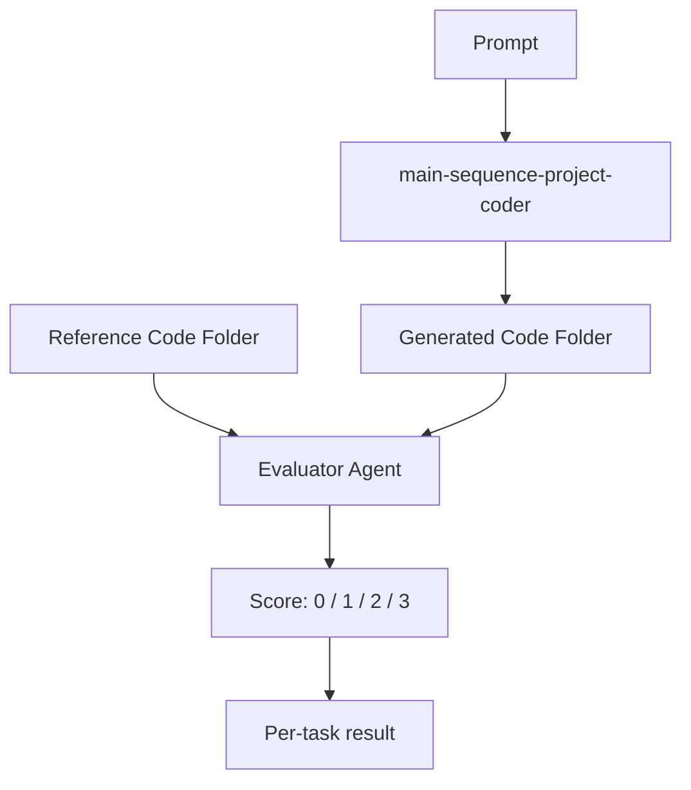
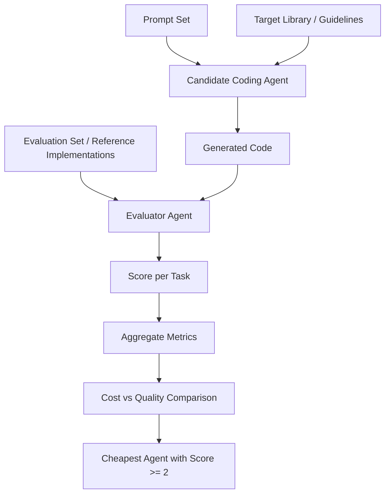

# Research guide

## Research problem: cost-effective agent evaluation for code generation

We want a repeatable way to identify the cheapest coding agent that can complete a code-generation task at an acceptable quality level.

We start with a specific example: an agent called `main-sequence-project-coder`. This agent takes a prompt and generates a full code folder that is intended to satisfy the prompt and follow Main Sequence library guidelines.

A second, stronger evaluator agent then compares the generated code against our reference implementation and assigns a score. This gives us a concrete Agent / Evaluator setup that can later be generalized into a broader experiment where the output is code.

For `main-sequence-project-coder`, we will provide several prompts and project examples.

The first test prompt is:

`Build me a project that replicates the tutorial project in https://github.com/mainsequence-sdk/mainsequence-sdk/tree/main/docs`

The result here can be easily compared with the repository here:
`https://github.com/mainsequence-projects/introduction-tutorial`

The next prompt and project will be shared as public repos in:
`https://github.com/mainsequence-projects`

Each project will also include the prompt used to generate the project.

The current Astro agent is an orchestrator agent, but for this evaluation we only care about the `main-sequence-project-coder` agent.

## Particular example: `main-sequence-project-coder`

### Inputs

- prompt describing the coding task
- Main Sequence library guidelines
- reference project or code folder

### Output

- a full generated code folder representing the prompt intent and following Main Sequence conventions

### Evaluation

This is where Know Center expertise will be very valuable in designing the experiment and the evaluation measure.

A secondary evaluator agent compares:

- the generated code folder
- our version of the code

The evaluator assigns a score using a stronger model, such as GPT-5.4 or a top Anthropic model.

### Proposed scoring scale

- `0` - does not fulfill the task
- `1` - fulfills the task, but needs significant improvements
- `2` - fulfills the task
- `3` - fulfills the task and improves on the expected solution

## Particular example workflow



## Generalized experiment

We want to generalize this into an Agent / Evaluator experiment for code generation.

### Experiment inputs

- a set of prompts
- a target coding library or framework
- an evaluation set
- a set of candidate coding agents or models
- a strong evaluator model

### Experiment goal

1. find the cheapest LLM-based coding agent that can perform the task
2. build a repeatable and measurable process for identifying the cheapest agent that scores at least `2`

## Research objective

The objective is not only to compare models on quality, but to compare them on cost-adjusted usefulness.

The key question is:

> What is the cheapest coding agent that can reliably achieve a score of `2` or higher on the evaluation set?

## Measurement framework

For each candidate coding agent, we run the same evaluation process across the same prompt set and measure:

- score per task
- average score
- distribution of scores
- percentage of tasks scoring `2` or higher
- cost per run
- total cost across the evaluation set
- cost per acceptable result

## Success criterion

An agent is acceptable if it:

- achieves a score of `2` or higher
- does so reliably across the evaluation set
- is cheaper than alternative agents with similar quality

The preferred agent is the lowest-cost agent that still meets the target quality threshold.

## Generalized workflow



## Expected outcome

The outcome of this research should be a standard evaluation framework for code-generation agents that allows us to:

- test multiple coding agents on the same benchmark
- evaluate them with a consistent judging process
- measure both quality and cost
- select the cheapest acceptable agent for a given coding domain

## Deliverable

A reusable Agent / Evaluator experiment framework for code generation, starting with `main-sequence-project-coder` and extending to any coding library, prompt suite, or evaluation set.

## Direct specialist execution

Use this when you want a focused Astro run without the full parent-orchestrator workflow.

### When to use direct specialist mode

Launch a specialist directly when you want:

- one constrained Pi session
- no parent orchestration
- no `delegate_specialist` tool in the session
- one known role, such as `mainsequence-project-coder`

This is useful for focused implementation or investigation inside an already checked-out project.

### Launch `mainsequence-project-coder` directly

Interactive mode:

```bash
npm run specialist -- --agent mainsequence-project-coder --cwd /absolute/path/to/checked-out-project --project-id <project-id>
```

Single-task mode:

```bash
npm run specialist -- --agent mainsequence-project-coder --cwd /absolute/path/to/checked-out-project --project-id <project-id> "Read the project's task and status context, then implement the next task"
```

### What this does

The launcher starts Pi in specialist mode with:

- `ASTRO_SUBAGENT_CHILD=1`
- `ASTRO_ACTIVE_SPECIALIST=mainsequence-project-coder`
- the specialist prompt loaded as an appended system prompt
- the specialist's tool restrictions

That means the session behaves like Astro's delegated child process, but you start it directly from the terminal.

### When not to use it

Do not use direct specialist mode when you still need Astro to:

- create or select a Main Sequence project
- write the initial `astro/` handoff files
- choose between multiple specialists
- review status at the orchestration layer

For those cases, use the normal parent flow instead:

```bash
npm run pi
```
